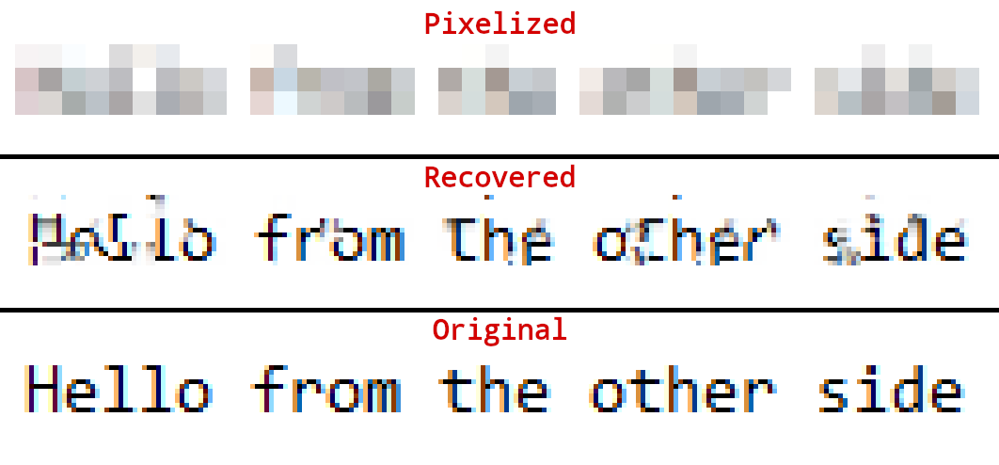
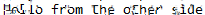
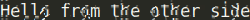

# Depix
Depix is a tool for recovering passwords from pixelized screenshots.

This implementation works on pixelized images that were created with a linear box filter.
In [this article](https://www.linkedin.com/pulse/recovering-passwords-from-pixelized-screenshots-sipke-mellema) I cover background information on pixelization and similar research.

## Example


## Installation
* Clone the repo:
```sh
git clone https://github.com/beurtschipper/Depix.git
cd Depix
```
* Install the dependencies:
```sh
python -m pip install -r requirements.txt
```
* Run Depix:
```sh
python depix.py -p /path/to/your/input/image.png -s images/searchimages/debruinseq_notepad_Windows10_closeAndSpaced.png -o /path/to/your/output.png
```

## Example usage

* Depixelize example image created with Notepad and pixelized with Greenshot. Greenshot averages by averaging the gamma-encoded 0-255 values, which is Depix's default mode.
```
python3 depix.py -p images/testimages/testimage3_pixels.png -s images/searchimages/debruinseq_notepad_Windows10_closeAndSpaced.png
```
Result: 

* Depixelize example image created with Sublime and pixelized with Gimp, where averaging is done in linear sRGB. The backgroundcolor option filters out the background color of the editor.
```
python3 depix.py -p images/testimages/sublime_screenshot_pixels_gimp.png -s images/searchimages/debruin_sublime_Linux_small.png --backgroundcolor 40,41,35 --averagetype linear
```
Result: 

## About
### Making a Search Image
* Cut out the pixelated blocks from the screenshot as a single rectangle.
* Paste a [De Bruijn sequence](https://en.wikipedia.org/wiki/De_Bruijn_sequence) with expected characters in an editor with the same font settings as your input image (Same text size, similar font, same colors).
* Make a screenshot of the sequence.
* Move that screenshot into a folder like `images/searchimages/`.
* Run Depix with the `-s` flag set to the location of this screenshot.

### Algorithm
The algorithm uses the fact that the linear box filter processes every block separately. For every block it pixelizes all blocks in the search image to check for direct matches.

For most pixelized images Depix manages to find single-match results. It assumes these are correct. The matches of surrounding multi-match blocks are then compared to be geometrically at the same distance as in the pixelized image. Matches are also treated as correct. This process is repeated a couple of times.

After correct blocks have no more geometrical matches, it will output all correct blocks directly. For multi-match blocks, it outputs the average of all matches.
The algorithm uses the fact that the linear box filter processes every block separately. For every block it pixelizes all blocks in the search image to check for direct matches. 

### Known limitations

* The algorithm matches by integer block-boundaries. As a result, it has the underlying assumption that for all characters rendered (both in the de Brujin sequence and the pixelated image), the text positioning is done at pixel level. However, some modern text rasterizers position text [at sub-pixel accuracies](http://agg.sourceforge.net/antigrain.com/research/font_rasterization/).
* ~~The algorithm currently performs pixel averaging in the image's gamma-corrected RGB space. As a result, it cannot reconstruct images pixelated using linear RGB.~~

### Future development

* Implement more filter functions

Create more averaging filters that work like some popular editors do.

* Create a new tool that utilizes HMMs

After creating this program, someone pointed me to a research document from 2016 where a group of researchers managed to create a similar tool. Their tool has better precision and works across many different fonts. However, their code is not public. I encourage anyone passionate about this type of depixalization to implement their HMM-based version and share it:

https://www.researchgate.net/publication/305423573_On_the_Ineffectiveness_of_Mosaicing_and_Blurring_as_Tools_for_Document_Redaction
